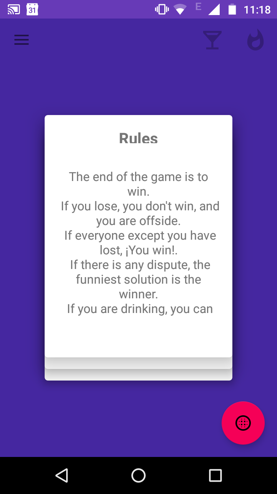
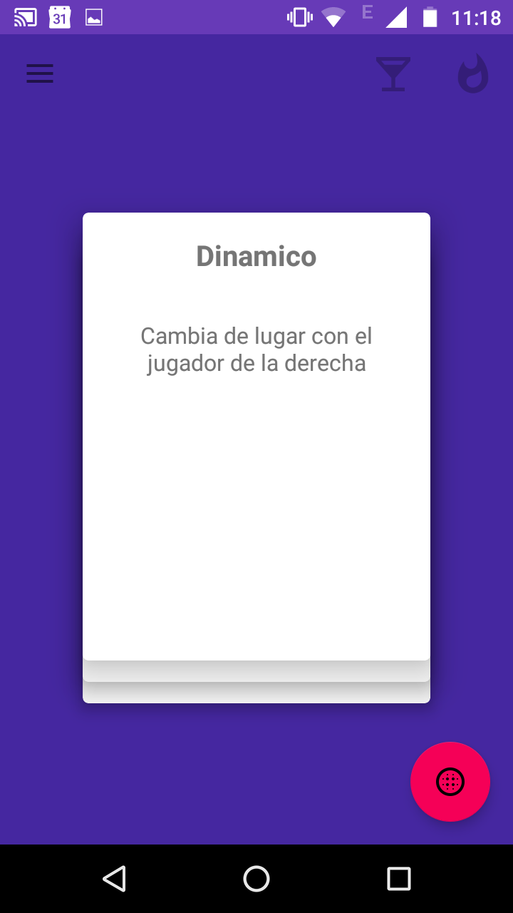
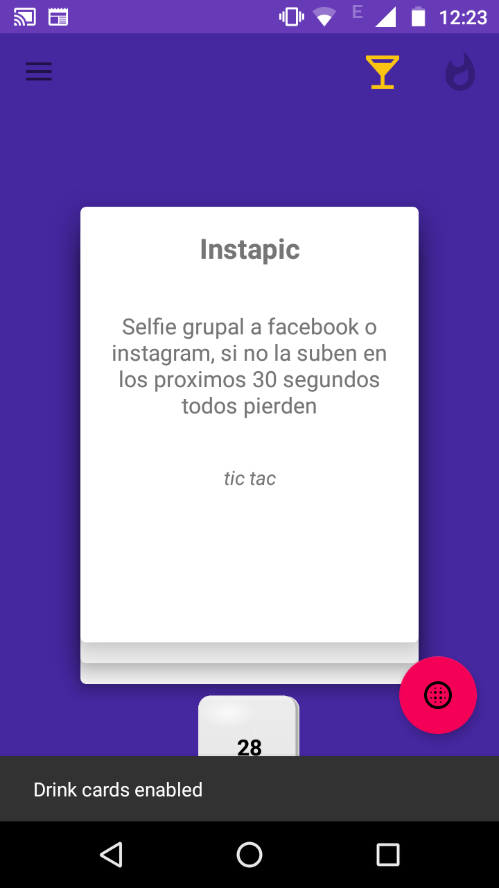
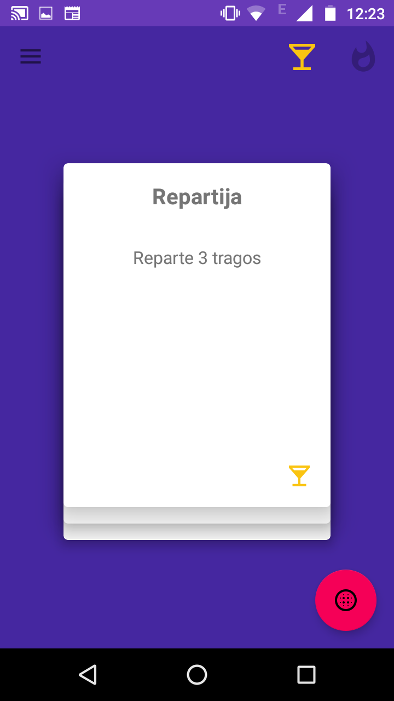

# Discord

> Funny and entertaining game in which users have to draw a card and do as it says.
 Star

<div style="text-align:center">
  
  
  
  
</div>

If you want to add your custom cards you can do it either from the app or by modifyng the file
in your SD card.

## Rules

The objective of the game is to win. If you lose, then you don't win and you are out of the match.
If everyone except you has lost, you win. The funniest choice is the solution to disputes.
If you are drinking you can add the rule: `Drink if you lose`

## How to play

First player must draw a card and read it out loud, do what it says and let the next player take
a card.

Every match should not take more than 8 minutes.


## `YAML` file format

```
-
  title: '<card title>'
  description: '<card description>'
  quote: '<card quote, appears in italic>'
  quantity: '<number of times this card will be added to the deck>'
  timer: <an automatic timer will be displayed>
  tags:
    - <normal, drink or hardcore, pick one>
    - <discord is optional and will appear within the discord cards>
  dice: <comma separated dice will be generated automatically by the app>
-
  title: 'Example card'
  description: 'Example description, so everyone loses'
  quote: 'This is a good example'
  quantity: 1
  timer:
  tags:
    - normal
  dice:
```

## Tags

There are different ways to classify a card, the user of the app is allowed to active or deactivate
this different tags.

### Normal [Default:active]

Always active, this cards are the main protagonist of the game, making it friendly for everybody.
Representation in the YAML is `normal`, lower case.
YAML: `normal`

### Drink [Default:inactive]

Drinking related cards, the description often includes having something to drink nearby or having
to drink in order to win.
YAML: `drink`

### Hardcore [Default:inactive]

These cards are spice up the game, include cards with sexual connotation, maybe black humour,
obviously you can't play these cards with everybody.
YAML: `hardcore`

### Discord cards

One of the previous tags can also have a `discord` tag, which will make it appear in the discord deck.
The idea behind the discord card is to have just one during a match. They apply modifiers during the
whole match.
YAML: `discord`


## Contributing

Read CONTRIBUTING guide.